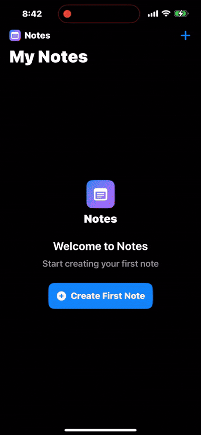

# 📒 Note-Taking App (iOS + Firebase)

A simple **iOS note-taking app** built with **SwiftUI** in Xcode.  
The app integrates with **Firebase (Firestore)** for cloud storage and authentication, and includes a **custom app icon** generated with the help of ChatGPT.

## Demo



---

## ✨ Features

- 📌 Create, update, and delete notes  
- 🔄 Real-time sync with Firebase Firestore  
- 🔐 Anonymous user authentication (per-user notes)  
- 📱 Runs on iPhone via Xcode with Developer Mode enabled  
- 🎨 Custom app logo  

---

## 🛠️ Setup Instructions

### 1. Prerequisites
- macOS Sequoia or newer
- Xcode 15 (or later)
- iPhone with **Developer Mode** enabled
- A [Firebase Project](https://firebase.google.com/)

### 2. Clone the repo
```bash
git clone https://github.com/ShanaFlash/FirstProgrammingNoteApp.git
cd FirstProgrammingNoteApp
open FirstProgrammingNoteApp.xcodeproj
```

### 3. Add Firebase config
1. Create a Firebase project in the console.  
2. Register your iOS app (`com.yourname.FirstProgramming`).  
3. Download the `GoogleService-Info.plist`.  
4. Drag it into your Xcode project, checking “Copy items if needed.”

### 4. Install Firebase via Swift Package Manager
- URL: `https://github.com/firebase/firebase-ios-sdk.git`
- Pin to **11.14.0** (latest 11.x version for Xcode 15)
- Add `FirebaseAuth`, `FirebaseFirestore`, `FirebaseFirestoreSwift`

### 5. Run on iPhone
- Connect your iPhone and select it in the Xcode device list.
- Ensure **Signing & Capabilities** → Team is set to your Apple ID.
- Press **⌘R** to build and run.

---

## 🖼️ Screenshots

| App Logo | App Running | Firestore Data |
|----------|-------------|----------------|
|  |  |  |

*(Replace with your actual screenshots)*

---


## 🐛 Debugging Notes

- **Issue:** Firebase 12.x required Swift 6 / Xcode 16+  
  - **Fix:** Pinned SDK to Firebase 11.x to work with Xcode 15  
- **Issue:** Could not change dependency rule in Xcode  
  - **Fix:** Removed & re-added package, reset package caches  
- **Issue:** Signing issues on iPhone  
  - **Fix:** Enabled Developer Mode, added Apple ID in Xcode, trusted developer certificate  

---

## 🔗 Repo & Backend

- Backend: Firebase Firestore (anonymous auth)  

---

## 📜 Git History & Collaboration

- **Initial commit** — Base SwiftUI project  
- **Firebase integration** — Added Firestore
- **CRUD operations** — Implemented note create/read/update/delete  
- **Bugfixes** — Fixed version conflicts and signing errors  
- **Final polish** — Added custom logo, updated README  


## 🚀 Future Work

- 🔍 Add search & filtering for notes  
- ☁️ Support CloudKit as alternative backend  
- 👥 Multi-user note sharing  
- 📤 Export/import notes  

---

## 🙏 Acknowledgements

- Firebase Team  
- Apple Developer Documentation  

